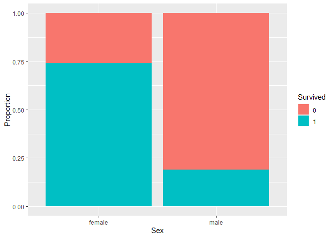
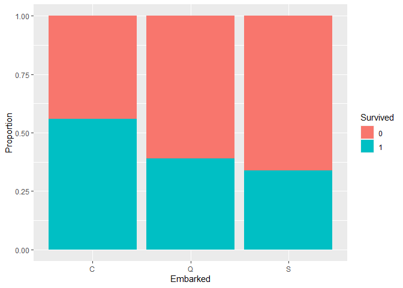
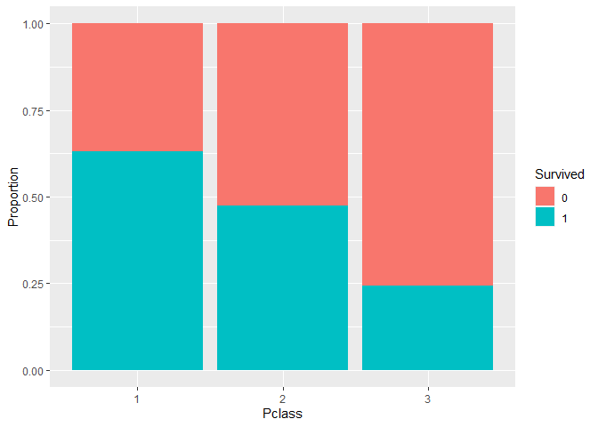
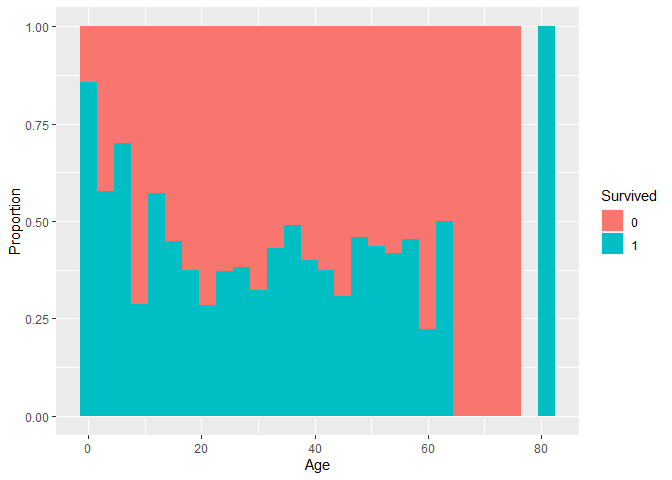
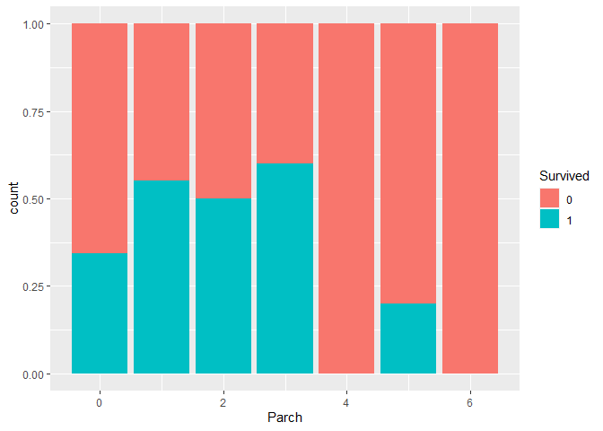
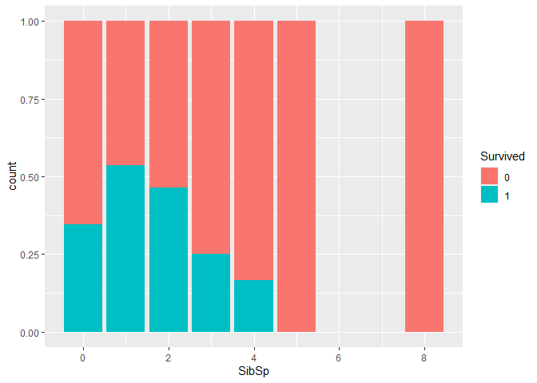
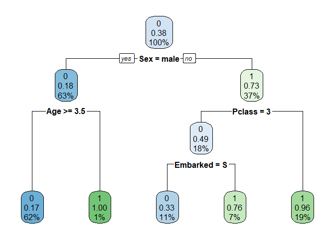
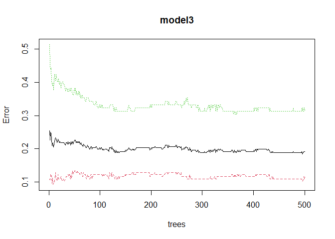

RMS Titanic Survival
================
Chu Ngwoke
09/08/2021

## Introduction

RMS Titanic was the largest ship afloat at the time she entered service
and was the second of the three Olympic-class ocean liners by the White
Star Line. It was largely thought to be unsinkable, however, on its
maiden voyage on 14th April, 1912, It collided with an iceberg and sank,
resulting in one of the most famous tragedies in modern history. 1502
out of 2224 passengers and crew died.

While there was some element of luck involved in surviving, it seems
some groups of people on the ship were more likely to survive than
others. In this analysis, a predictive model is built to answer the
question: “what sorts of people were more likely to survive?” using
passenger data (ie name, age, gender, socio-economic class, etc)

## Loading Data and Required Packages

The dataset comes from kaggle Titanic competition page. You can find the
it [here](https://www.kaggle.com/c/titanic/data). This is an open data
on the passengers aboard the RMS Titanic on its tragic voyage. The data
has been split into train and test sets. The train set has 891
observations while the test set has 418 observations. A data dictionary
defining the variables in the dataset is provided in the link above.

``` r
test_data <- read.csv("test.csv")
train_data <- read.csv("train.csv")

library(tidyr)
library(ggplot2)
library(GGally)
library(rpart)
library(rpart.plot)
library(randomForest)
```

## Data Cleaning

``` r
str(train_data)     # structure of the datasets
```

    ## 'data.frame':    891 obs. of  12 variables:
    ##  $ PassengerId: int  1 2 3 4 5 6 7 8 9 10 ...
    ##  $ Survived   : int  0 1 1 1 0 0 0 0 1 1 ...
    ##  $ Pclass     : int  3 1 3 1 3 3 1 3 3 2 ...
    ##  $ Name       : chr  "Braund, Mr. Owen Harris" "Cumings, Mrs. John Bradley (Florence Briggs Thayer)" "Heikkinen, Miss. Laina" "Futrelle, Mrs. Jacques Heath (Lily May Peel)" ...
    ##  $ Sex        : chr  "male" "female" "female" "female" ...
    ##  $ Age        : num  22 38 26 35 35 NA 54 2 27 14 ...
    ##  $ SibSp      : int  1 1 0 1 0 0 0 3 0 1 ...
    ##  $ Parch      : int  0 0 0 0 0 0 0 1 2 0 ...
    ##  $ Ticket     : chr  "A/5 21171" "PC 17599" "STON/O2. 3101282" "113803" ...
    ##  $ Fare       : num  7.25 71.28 7.92 53.1 8.05 ...
    ##  $ Cabin      : chr  "" "C85" "" "C123" ...
    ##  $ Embarked   : chr  "S" "C" "S" "S" ...

``` r
#str(test_data)

colSums(is.na(train_data))  # checking for missing values in the dataset
```

    ## PassengerId    Survived      Pclass        Name         Sex         Age 
    ##           0           0           0           0           0         177 
    ##       SibSp       Parch      Ticket        Fare       Cabin    Embarked 
    ##           0           0           0           0           0           0

``` r
#colSums(is.na(test_data))

colSums(train_data == "")
```

    ## PassengerId    Survived      Pclass        Name         Sex         Age 
    ##           0           0           0           0           0          NA 
    ##       SibSp       Parch      Ticket        Fare       Cabin    Embarked 
    ##           0           0           0           0         687           2

``` r
# There are a lot of missings data in the Age variable.
# 177 out of 891 passengers have missing age in the train data
# 86 out 418 passengers have missing age in the test set.
# There are 2 empty strings in Embarked and many empty strings in Cabin variable

train_data$Age[is.na(train_data$Age)] <- mean(train_data$Age, na.rm = T) #replacing the NAs in age with mean age
train_data$Embarked[train_data$Embarked == ""] = "C"   # Replacing the missing Embarked with the first port
```

``` r
apply(train_data, 2, function(x) length(unique(x)))  #checking the columns that are factors
```

    ## PassengerId    Survived      Pclass        Name         Sex         Age 
    ##         891           2           3         891           2          89 
    ##       SibSp       Parch      Ticket        Fare       Cabin    Embarked 
    ##           7           7         681         248         148           3

``` r
# The variables Survived, Pclass, Sex and Embarked are factors.
# converting them to factors

cols <- c("Survived", "Pclass", "Sex", "Embarked")
for (i in cols){
  train_data[,i] <- as.factor(train_data[,i])
}

str(train_data)  # viewing the structure of the dataset
```

    ## 'data.frame':    891 obs. of  12 variables:
    ##  $ PassengerId: int  1 2 3 4 5 6 7 8 9 10 ...
    ##  $ Survived   : Factor w/ 2 levels "0","1": 1 2 2 2 1 1 1 1 2 2 ...
    ##  $ Pclass     : Factor w/ 3 levels "1","2","3": 3 1 3 1 3 3 1 3 3 2 ...
    ##  $ Name       : chr  "Braund, Mr. Owen Harris" "Cumings, Mrs. John Bradley (Florence Briggs Thayer)" "Heikkinen, Miss. Laina" "Futrelle, Mrs. Jacques Heath (Lily May Peel)" ...
    ##  $ Sex        : Factor w/ 2 levels "female","male": 2 1 1 1 2 2 2 2 1 1 ...
    ##  $ Age        : num  22 38 26 35 35 ...
    ##  $ SibSp      : int  1 1 0 1 0 0 0 3 0 1 ...
    ##  $ Parch      : int  0 0 0 0 0 0 0 1 2 0 ...
    ##  $ Ticket     : chr  "A/5 21171" "PC 17599" "STON/O2. 3101282" "113803" ...
    ##  $ Fare       : num  7.25 71.28 7.92 53.1 8.05 ...
    ##  $ Cabin      : chr  "" "C85" "" "C123" ...
    ##  $ Embarked   : Factor w/ 3 levels "C","Q","S": 3 1 3 3 3 2 3 3 3 1 ...

## Analysis

The data has been loaded and cleaned up. I proceed to analyse the data
to find the relationship between each variable and survival. I will use
Percentage bar plots to visualize the relative chance of survival due to
each variable

``` r
# Sex and survival
ggplot(data = train_data, aes(x=Sex, fill=Survived)) + geom_bar(position = "fill") + ylab("Proportion")
```

<!-- -->

``` r
# Port of Embarkation and Survival
ggplot(data = train_data, aes(x=Embarked, fill=Survived)) + geom_bar(position = "fill") + ylab("Proportion")
```

<!-- -->

``` r
# Ticket Class and Survival
ggplot(data = train_data, aes(x=Pclass, fill=Survived)) + geom_bar(position = "fill") + ylab("Proportion")
```

<!-- -->

``` r
# Age and Survivial
ggplot(data = train_data, aes(x=Age, fill=Survived)) + geom_histogram(binwidth = 3, position = "fill") + ylab("Proportion")
```

    ## Warning: Removed 2 rows containing missing values (geom_bar).

<!-- -->

``` r
# Parch (Number of Parents and Children aboard) and Survival
ggplot(data = train_data, aes(x=Parch, fill=Survived)) + geom_bar(position = "fill")
```

<!-- -->

``` r
# SibSp (Number of Siblings and Spouse aboard) and Survival
ggplot(data = train_data, aes(x=SibSp, fill=Survived)) + geom_bar(position = "fill")
```

<!-- -->

From the plots, It appears that;

  - Females had a higher chance (75%) of survival as opposed to less
    than 25% for males.

  - Passengers that embarked at the first port had a slightly higehr
    chance of survival but this is not clearly different from the other
    ports

  - Passengers in the lower ticket class (class 1) had a higher chance
    of survival and passengers in the highest class had the least chance
    of survival

  - Children younger than 10 years and Old people 80 years and above had
    the higher chance of survival than other ages

  - Passengers with less than 4 Sibling/Spouse and/or 4 Parent/Child
    aboard had a higher chance of survival

## Prediction

I have identified how some of the variables affect probability of
survival. I proceed to build a prediction model based on these
variables. I will use logistic regression, random forest and decision
tree classifications to build my model. I split the training set into a
train set (train1) and a test set (train2) in a ratio of 70:30 to be
able to estimate error in my models.

``` r
# Splitting the train data into train and test sets
library(caret)
```

    ## Warning: package 'caret' was built under R version 4.0.2

    ## Loading required package: lattice

``` r
set.seed(1234)  # setting seed for reproducibility

index <- createDataPartition(train_data$Survived, p = 0.7, list = FALSE)
train1 <- train_data[index,]
train2 <- train_data[-index,]
```

### Logistic Regression Model

``` r
# Let me run a logistic regression with the variables
model1 <- glm(Survived ~ Sex+Age+Embarked+SibSp+Parch+Pclass, data = train1, family = binomial(link = "logit"))
summary(model1)
```

    ## 
    ## Call:
    ## glm(formula = Survived ~ Sex + Age + Embarked + SibSp + Parch + 
    ##     Pclass, family = binomial(link = "logit"), data = train1)
    ## 
    ## Deviance Residuals: 
    ##     Min       1Q   Median       3Q      Max  
    ## -2.0063  -0.6309  -0.3790   0.5839   2.5631  
    ## 
    ## Coefficients:
    ##              Estimate Std. Error z value Pr(>|z|)    
    ## (Intercept)  4.574270   0.545863   8.380  < 2e-16 ***
    ## Sexmale     -2.782823   0.244650 -11.375  < 2e-16 ***
    ## Age         -0.042404   0.009834  -4.312 1.62e-05 ***
    ## EmbarkedQ    0.308751   0.480106   0.643  0.52017    
    ## EmbarkedS   -0.667921   0.278998  -2.394  0.01667 *  
    ## SibSp       -0.387569   0.137865  -2.811  0.00494 ** 
    ## Parch       -0.042776   0.156112  -0.274  0.78408    
    ## Pclass2     -1.019371   0.322873  -3.157  0.00159 ** 
    ## Pclass3     -2.461890   0.309786  -7.947 1.91e-15 ***
    ## ---
    ## Signif. codes:  0 '***' 0.001 '**' 0.01 '*' 0.05 '.' 0.1 ' ' 1
    ## 
    ## (Dispersion parameter for binomial family taken to be 1)
    ## 
    ##     Null deviance: 832.49  on 624  degrees of freedom
    ## Residual deviance: 536.03  on 616  degrees of freedom
    ## AIC: 554.03
    ## 
    ## Number of Fisher Scoring iterations: 5

``` r
# The model summary shows that the Parch and Embarked variables are not statistically significant

# Using model1 to predict survival on the test set

pred1 <- predict(model1, train2)
pred1 <- ifelse(pred1 > 0.5, 1, 0)
t1 <- table(pred1, train2$Survived)
confusionMatrix(t1) # confusion matrix to compute the accuracy of the model
```

    ## Confusion Matrix and Statistics
    ## 
    ##      
    ## pred1   0   1
    ##     0 147  38
    ##     1  17  64
    ##                                           
    ##                Accuracy : 0.7932          
    ##                  95% CI : (0.7395, 0.8403)
    ##     No Information Rate : 0.6165          
    ##     P-Value [Acc > NIR] : 4.694e-10       
    ##                                           
    ##                   Kappa : 0.545           
    ##                                           
    ##  Mcnemar's Test P-Value : 0.007001        
    ##                                           
    ##             Sensitivity : 0.8963          
    ##             Specificity : 0.6275          
    ##          Pos Pred Value : 0.7946          
    ##          Neg Pred Value : 0.7901          
    ##              Prevalence : 0.6165          
    ##          Detection Rate : 0.5526          
    ##    Detection Prevalence : 0.6955          
    ##       Balanced Accuracy : 0.7619          
    ##                                           
    ##        'Positive' Class : 0               
    ## 

``` r
# Model1 has an accuracy of 79.3%
```

### Decision Tree Model

``` r
model2 <- rpart(Survived~Sex+Age+Embarked+SibSp+Parch+Pclass, data = train1, method = "class")
rpart.plot(model2)  #building the model and showing the part plot
```

<!-- -->

``` r
# predicting using model2
pred2 <- predict(model2, train2, type="class")
t2 <- table(pred2, train2$Survived)
confusionMatrix(t2)
```

    ## Confusion Matrix and Statistics
    ## 
    ##      
    ## pred2   0   1
    ##     0 148  42
    ##     1  16  60
    ##                                           
    ##                Accuracy : 0.782           
    ##                  95% CI : (0.7274, 0.8301)
    ##     No Information Rate : 0.6165          
    ##     P-Value [Acc > NIR] : 5.932e-09       
    ##                                           
    ##                   Kappa : 0.5155          
    ##                                           
    ##  Mcnemar's Test P-Value : 0.001028        
    ##                                           
    ##             Sensitivity : 0.9024          
    ##             Specificity : 0.5882          
    ##          Pos Pred Value : 0.7789          
    ##          Neg Pred Value : 0.7895          
    ##              Prevalence : 0.6165          
    ##          Detection Rate : 0.5564          
    ##    Detection Prevalence : 0.7143          
    ##       Balanced Accuracy : 0.7453          
    ##                                           
    ##        'Positive' Class : 0               
    ## 

``` r
# The accuracy of the second model is 78.2%, slighlty less than the first model
```

### Random Forest Model

``` r
model3 <- randomForest(Survived~Sex+Age+Embarked+SibSp+Parch+Pclass, train2)
plot(model3)  # building the random forest model and ploting it
```

<!-- -->

``` r
# Predicting with the random forest model
pred3 <- predict(model3, train2)
t3 <- table(pred3, train2$Survived)
confusionMatrix(t3)
```

    ## Confusion Matrix and Statistics
    ## 
    ##      
    ## pred3   0   1
    ##     0 159  23
    ##     1   5  79
    ##                                           
    ##                Accuracy : 0.8947          
    ##                  95% CI : (0.8515, 0.9289)
    ##     No Information Rate : 0.6165          
    ##     P-Value [Acc > NIR] : < 2.2e-16       
    ##                                           
    ##                   Kappa : 0.7697          
    ##                                           
    ##  Mcnemar's Test P-Value : 0.001315        
    ##                                           
    ##             Sensitivity : 0.9695          
    ##             Specificity : 0.7745          
    ##          Pos Pred Value : 0.8736          
    ##          Neg Pred Value : 0.9405          
    ##              Prevalence : 0.6165          
    ##          Detection Rate : 0.5977          
    ##    Detection Prevalence : 0.6842          
    ##       Balanced Accuracy : 0.8720          
    ##                                           
    ##        'Positive' Class : 0               
    ## 

``` r
# The accuracy of the 3rd model is 89.5%. I therefore select this as my best model and use it on the main test set
```

### Prediction on Test Dataset

``` r
# cleaning the test data

cols2 <- c("Pclass", "Sex", "Embarked")
for (i in cols2){
  test_data[,i] <- as.factor(test_data[,i])
}
test_data$Age[is.na(test_data$Age)] <- mean(test_data$Age, na.rm = T) #replacing the NAs in age with mean age
test_data$Embarked[test_data$Embarked == ""] = "C"   # Replacing the missing Embarked with the first port

pred4 <- predict(model3, test_data)

titanic_prediction <- data.frame(test_data$PassengerId, pred4) # producing the required prediction table

names(titanic_prediction) <- c("PassengerId", "Survived")

#write.csv(titanic_prediction, file = "my_titanic_prediction.csv", row.names = F) #writing the table as csv to my drive
```

## Conclusion

The titanic dataset has been analysed in this work. Exploratory data
analysis was done to understand the influence of the variables on
survival. Prediction models were built to predict survival on the
Titanic ship using 3 techniques, namely, Logistic regression, decision
tree and random forest classification. The random forest model had the
highest accuracy of **89.5%** and was hence selected as the best
prediction model.
